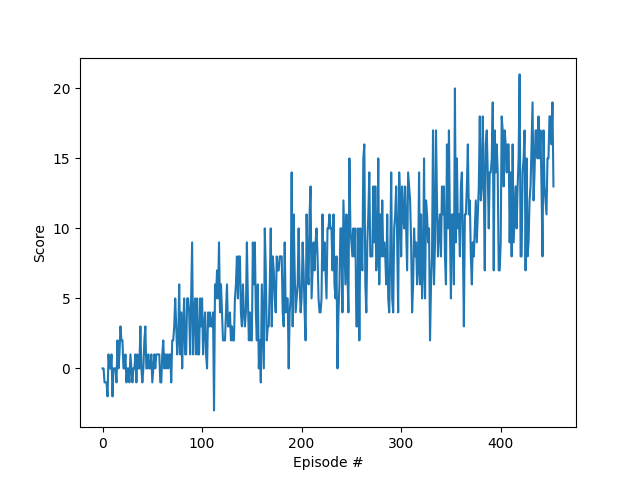

# Project report

## Learning algorithm

The learning algorithm used is Deep Q-Learning as described in this [research paper](https://storage.googleapis.com/deepmind-media/dqn/DQNNaturePaper.pdf).

Q-learning is an algorithm that learns the quality of possible actions for an input state. It maps these state action pairs in a Q-Table along with the maximum expected future reward for each pair.

Deep Q-Learning takes this a step further by replacing the Q-Table with a neural network. This network has an input that is the size of the state, and an output that is the size of the number of possible actions, with each action given a value for expected future reward. The actions can then be sorted and the one with the maximum value chosen if exploration is epsilon greedy.

The DQN uses experience replay. This means instead of the algorithm learning from the previous experiences in sequential order, it uses a replay buffer to store a certain number of experiences and samples randomly from this buffer for each update. This prevents the action values from getting falsely swayed by correlation between subsequent experiences. It also means experiences can be learned from multiple times and rare occurrences can be recalled.

Another feature of the DQN is it actually uses two neural networks. Every n steps, the weights from the main network are copied to the target network. This leads to more stability in the learning process by reducing the problem of a constantly moving target, thus helping the algorithm to learn more effectively.

## Architecture

The model architecture for the neural network is configured with the following layers:

- input: 37 (state size), output: 64
- input: 64, output: 64
- input: 64, output: 4 (action size)

All layers are fully connected (not convolutional) and linearly transformed with the first two layers activated by a Rectified Linear Unit (ReLu).

The following hyperparameters were used in the final training solution:

- Maximum steps per episode: 2000
- Start epsilon: 1.0
- End epsilon: 0.01
- Decay rate: 0.995
- Buffer size: 1e5
- Batch size: 64
- Gamma: 0.99 
- TAU: 1e-3 
- Learning rate: 5e-4 
- Update interval: 4

## Results

Episode 100	Average Score: 1.15  
Episode 200	Average Score: 4.70  
Episode 300	Average Score: 8.28  
Episode 400	Average Score: 10.80  
Episode 454	Average Score: 13.03  
Environment solved in 354 episodes!	Average Score: 13.03

## Ideas for future work

Some areas that could be investigated to improve the amount of time taken to train and the accuracy of final data:
- Optimising hyperparameters
- Double DQN
- Prioritized Experience Replay
- Dueling DQN
- Rainbow DQN
- Learning from pixels (using CNN)